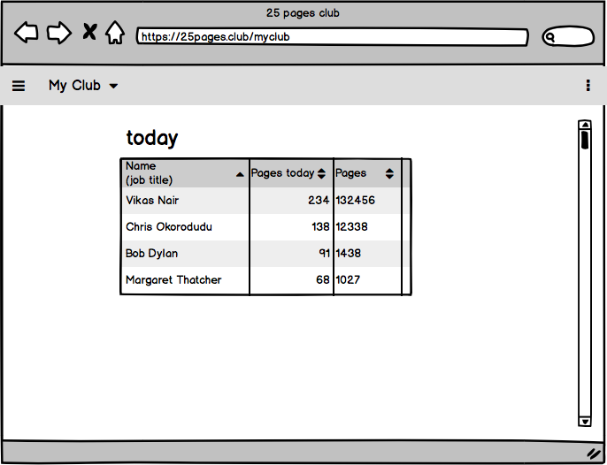

# 25 pages club 

## 25 a day. No excuses.

25 pages club is a web app that will motivate you to make reading your daily habbit! Let's be honest, we all wish we read more and more regularly.

A year ago I was also doing research (aka procrastinating) on how to make myself read more. I found a few articles and YouTube videos that suggested this simple and effective strategy: just to commit to reading 25 pages a day and you'll notice a life-changing difference. [check out this article](https://github.com/nyu-csci-ua-0480-008-spring-2018/dt1308-final-project.git) [and this video](https://www.youtube.com/watch?v=iiNISuM4wl0)

Before knowing how to build my own website I would use [Google Sheets](https://docs.google.com/spreadsheets/d/1JTNRAV_t4RNSDDJlno2HkTcegqYsFdJ5Db9VQLbXfgU/edit#gid=0) to try to document those pages and be organized. And I was surprised to find, that there is still no comprehensive reading tracker that would also give you organization and motivation to keep reading 25 a day. So here we are.

## Data Model

The application will store Users, Logs, Books, Authors.

* a Log is a daily log that includes date, book, author, number of pages and (optinally) comments.
* each user will have multiples Logs.

An Example Log:

```javascript
{
  date: ISODate("2018-02-10T10:50:42.389Z"),
  book: { title: "Atlas shrugged", author: "Ayn Rand"},
  pages: 26,
  comments: "Woah, objectivism is cool!",
}
```

An Example User with Embedded Logs:

```javascript
{
  user: // a reference to a User object,
  password: // a password hash,
  logs: [
    { date: ISODate("2018-02-10T10:50:42.389Z"), book: {title: "Atlas shrugged", author: "Ayn Rand"}, pages: 26, comments: "Woah, objectivism is cool!"},
    { date: ISODate("2018-04-02T07:55:42.389Z"), book: {title: "Denial of Death", author: "Ernest Becker"}, pages: 27, comments: "this. is. hard."},
  ],
}
```


## [Link to Commented First Draft Schema](db.js) 


## Wireframes

(___TODO__: wireframes for all of the pages on your site; they can be as simple as photos of drawings or you can use a tool like Balsamiq, Omnigraffle, etc._)

/add-log - a page for submitting a new log


/mylogs - page for showing all logs


/mystats - page for showing my stats


/myclub - page for showing the top readers from your 25 pages club



## Site map

(___TODO__: draw out a site map that shows how pages are related to each other_)

Here's a [complex example from wikipedia](https://upload.wikimedia.org/wikipedia/commons/2/20/Sitemap_google.jpg), but you can create one without the screenshots, drop shadows, etc. ... just names of pages and where they flow to.

## User Stories or Use Cases

(___TODO__: write out how your application will be used through [user stories](http://en.wikipedia.org/wiki/User_story#Format) and / or [use cases](https://www.mongodb.com/download-center?jmp=docs&_ga=1.47552679.1838903181.1489282706#previous)_)

1. as non-registered user, I can register a new account with the site
2. as a user, I can log in to the site
3. as a user, I can create a new grocery list
4. as a user, I can view all of the grocery lists I've created in a single list
5. as a user, I can add items to an existing grocery list
6. as a user, I can cross off items in an existing grocery list

## Research Topics

(___TODO__: the research topics that you're planning on working on along with their point values... and the total points of research topics listed_)

* (5 points) Integrate user authentication
    * I'm going to be using passport for user authentication
    * And account has been made for testing; I'll email you the password
    * see <code>cs.nyu.edu/~jversoza/ait-final/register</code> for register page
    * see <code>cs.nyu.edu/~jversoza/ait-final/login</code> for login page
* (4 points) Perform client side form validation using a JavaScript library
    * see <code>cs.nyu.edu/~jversoza/ait-final/my-form</code>
    * if you put in a number that's greater than 5, an error message will appear in the dom
* (5 points) vue.js
    * used vue.js as the frontend framework; it's a challenging library to learn, so I've assigned it 5 points

10 points total out of 8 required points (___TODO__: addtional points will __not__ count for extra credit_)


## [Link to Initial Main Project File](app.js) 

(___TODO__: create a skeleton Express application with a package.json, app.js, views folder, etc. ... and link to your initial app.js_)

## Annotations / References Used

(___TODO__: list any tutorials/references/etc. that you've based your code off of_)

1. [passport.js authentication docs](http://passportjs.org/docs) - (add link to source code that was based on this)
2. [tutorial on vue.js](https://vuejs.org/v2/guide/) - (add link to source code that was based on this)
