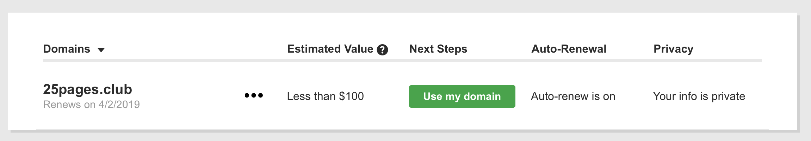

# 25 pages club 

## 25 a day. No excuses.

25 pages club is a web app that will motivate you to make reading your daily habbit! Let's be honest, we all wish we read more and more regularly.

A year ago I was also doing research (aka procrastinating) on how to make myself read more. I found a few articles and YouTube videos that suggested this simple and effective strategy: just to commit to reading 25 pages a day and you'll notice a life-changing difference. [check out this article](https://github.com/nyu-csci-ua-0480-008-spring-2018/dt1308-final-project.git) [and this video](https://www.youtube.com/watch?v=iiNISuM4wl0)

Before knowing how to build my own website I would use [Google Sheets](https://docs.google.com/spreadsheets/d/1JTNRAV_t4RNSDDJlno2HkTcegqYsFdJ5Db9VQLbXfgU/edit#gid=0) to try to document those pages and be organized. And I was surprised to find, that there is still no comprehensive reading tracker that would also give you organization and motivation to keep reading 25 a day. So here we are.

## Data Model

The application will store Users, Logs, Books, Authors.

* a Log is a daily log that includes date, book, author, number of pages and (optinally) comments.
* each user will have multiples Logs.

An Example Log:

```javascript
{
  date: ISODate("2018-02-10T10:50:42.389Z"),
  book: { title: "Atlas shrugged", author: "Ayn Rand"},
  pages: 26,
  comments: "Woah, objectivism is cool!",
}
```

An Example User with Embedded Logs:

```javascript
{
  user: // a reference to a User object,
  password: // a password hash,
  state: "public",
  logs: [
    { date: ISODate("2018-02-10T10:50:42.389Z"), book: {title: "Atlas shrugged", author: "Ayn Rand"}, pages: 26, comments: "Woah, objectivism is cool!"},
    { date: ISODate("2018-04-02T07:55:42.389Z"), book: {title: "Denial of Death", author: "Ernest Becker"}, pages: 27, comments: "this. is. hard."},
  ],
}
```


## [Link to Commented First Draft Schema](db.js) 


## Wireframes

/add-log - a page for submitting a new log


/mylogs - page for showing all logs


/mystats - page for showing my stats


/topchart - page for showing the top readers from your 25 pages club


## 


## User Stories or Use Cases

1. as non-registered user, I can register a new account with the site
2. as non-registrered user, I can see the top chart of all users with state "public" (to get a feel of achievements that users make)
3. as a user, I can log in to the site
4. as a user, I can add new logs
5. as a user, I can edit an existing log
6. as a user, I can view the statistics of the history of my logs
7. as a user, I see the top chart of all users with state "public"
8. as a user, I can change my email, password and other personal details

## Research Topics

* (4 points) Perform client side form validation using a JavaScript library
    * most likely [Parsley.js](http://parsleyjs.org)
* (2 points) Use a CSS framework throughout your site, use a reasonable of customization of the framework
	* Bootstrap/ Foundation
* (3 points) Unit testing with JavaScript
* (1 points) Configure domain name 



## [Link to Initial Main Project File](src/app.js) 

## Annotations / References Used

1. [Parsley.js](http://parsleyjs.org)
2. [tutorial on vue.js](https://vuejs.org/v2/guide/) - (add link to source code that was based on this)
